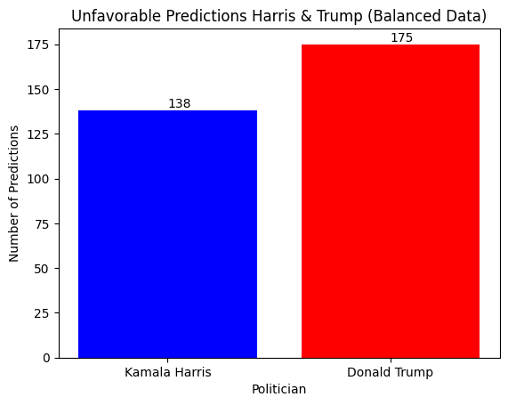

# Presidential Election Unfavorability 2024 

## Overview
This notebook uses classification modeling to predict the likelihood of the next President being Kamala Harris or Donald Trump based on current unfavorability ratings.

## Objectives
- Predict whether the politician is Kamala Harris or Donald Trump.
- Calculate the accuracy of the model.
- Visualize the results using `matplotlib`.

## Tools Used
- numpy
- pandas
- scikit-learn
- tensorflow
- imblearn
- matplotlib

## Dataset
This dataset provides detailed unfavorability ratings for both candidates. For this analysis, we focus on the following.
- Politician (Kamala Harris or Donald Trump)
- Favorability
- Unfavorability

## Model
We will use the following models for this task.
- TensorFlow Sequential

## Credits
**Dataset Author:**
* FiveThirtyEight

**Model Author:**  
* Kevin Thomas

**Date:**  
* 07-26-24  

**Version:**  
* 1.0


```python
import os
import requests
import zipfile
import numpy as np
import pandas as pd
from sklearn.model_selection import train_test_split
from sklearn.preprocessing import StandardScaler, OneHotEncoder
from sklearn.utils import resample
from sklearn.utils.class_weight import compute_class_weight
import tensorflow as tf
from tensorflow.keras.models import Sequential # type: ignore
from tensorflow.keras.layers import Dense, Input, LeakyReLU # type: ignore
from imblearn.over_sampling import SMOTE
import matplotlib.pyplot as plt
```

## Step 1: Data Preparation


```python
# Download and extract the dataset
url = 'https://www.kaggle.com/api/v1/datasets/download/mytechnotalent/favorability-polls-07-26-24?datasetVersionNumber=1'
local_filename = 'archive.zip'
response = requests.get(url, stream=True)
if response.status_code == 200:
    with open(local_filename, 'wb') as f:
        for chunk in response.iter_content(chunk_size=8192):
            f.write(chunk)
    print(f'Download completed: {local_filename}')
else:
    print(f'Failed to download the file. Status code: {response.status_code}')
if response.status_code == 200:
    with zipfile.ZipFile(local_filename, 'r') as zip_ref:
        zip_ref.extractall('.')
    print('Unzipping completed')
else:
    print('Skipping unzipping due to download failure')

# Load the dataset
data = pd.read_csv('favorability_polls_07-26-24.csv')

# Filter the dataset to include only Kamala Harris and Donald Trump
filtered_data = data[(data['politician'] == 'Kamala Harris') | (data['politician'] == 'Donald Trump')]

# Fill NaN values with the mean of the column in a new DataFrame
filtered_data = filtered_data.copy()  # Create a copy of the DataFrame to avoid chained assignment
filtered_data['favorable'] = filtered_data['favorable'].fillna(filtered_data['favorable'].mean())
filtered_data['unfavorable'] = filtered_data['unfavorable'].fillna(filtered_data['unfavorable'].mean())

# Separate the majority and minority classes
harris_data = filtered_data[filtered_data['politician'] == 'Kamala Harris']
trump_data = filtered_data[filtered_data['politician'] == 'Donald Trump']

# Ensure equal number of samples for both candidates
min_samples = min(harris_data.shape[0], trump_data.shape[0])
harris_resampled = resample(harris_data, replace=False, n_samples=min_samples, random_state=42)
trump_resampled = resample(trump_data, replace=False, n_samples=min_samples, random_state=42)

# Combine the resampled datasets
balanced_data = pd.concat([harris_resampled, trump_resampled])

# Shuffle the dataset
balanced_data = balanced_data.sample(frac=1, random_state=42)

# Prepare data for modeling
X_balanced = balanced_data[['unfavorable']].values
y_balanced = balanced_data['politician'].values
```

## Step 2: Feature Engineering


```python
# One-hot encode the politician column
encoder = OneHotEncoder(sparse_output=False)
y_balanced_encoded = encoder.fit_transform(balanced_data[['politician']])

# Split data into training and testing sets
X_train_balanced, X_test_balanced, y_train_balanced, y_test_balanced = train_test_split(X_balanced, y_balanced_encoded, test_size=0.2, random_state=42)

# Normalize the data
scaler = StandardScaler()
X_train_balanced_scaled = scaler.fit_transform(X_train_balanced)
X_test_balanced_scaled = scaler.transform(X_test_balanced)

# Calculate class weights to address imbalance
class_weights = compute_class_weight(
    class_weight='balanced',
    classes=np.unique(np.argmax(y_balanced_encoded, axis=1)),
    y=np.argmax(y_balanced_encoded, axis=1)
)
class_weight_dict = dict(enumerate(class_weights))

# Print class weights
print("Class weights:", class_weight_dict)
```

    Class weights: {0: 1.0, 1: 1.0}


## Step 3: Modeling


```python
# Build the model
model_balanced = Sequential([
    Input(shape=(1,)),
    Dense(16),
    LeakyReLU(alpha=0.01),
    Dense(8),
    LeakyReLU(alpha=0.01),
    Dense(2, activation='softmax')
])

# Compile the model
model_balanced.compile(optimizer='adam', loss='categorical_crossentropy', metrics=['accuracy'])

# Define the sampling strategy to control the amount of resampling
sampling_strategy = 'minority'  

# Apply SMOTE to balance the training data with adjustable parameters
smote = SMOTE(
    sampling_strategy=sampling_strategy,
    k_neighbors=4,  # Adjust the number of neighbors for SMOTE
    random_state=42
)
X_train_balanced_smote, y_train_balanced_smote = smote.fit_resample(X_train_balanced_scaled, np.argmax(y_train_balanced, axis=1))

# Convert y_train_balanced_smote to one-hot encoding
y_train_balanced_smote_encoded = tf.keras.utils.to_categorical(y_train_balanced_smote)

# Train the model with the resampled data
history_balanced = model_balanced.fit(
    X_train_balanced_smote, y_train_balanced_smote_encoded,
    epochs=50,
    batch_size=32,
    validation_data=(X_test_balanced_scaled, y_test_balanced),
    class_weight=class_weight_dict
)

# Evaluate the model
test_loss_balanced, test_accuracy_balanced = model_balanced.evaluate(X_test_balanced_scaled, y_test_balanced)
print(f'Test Accuracy with Balanced Data: {test_accuracy_balanced:.4f}')
```

    Epoch 1/50


    /Users/kevinthomas/Documents/data-science/venv/lib/python3.11/site-packages/keras/src/layers/activations/leaky_relu.py:41: UserWarning: Argument `alpha` is deprecated. Use `negative_slope` instead.
      warnings.warn(


    40/40 ━━━━━━━━━━━━━━━━━━━━ 0s 2ms/step - accuracy: 0.5230 - loss: 0.6982 - val_accuracy: 0.7157 - val_loss: 0.6339
    Epoch 2/50
    40/40 ━━━━━━━━━━━━━━━━━━━━ 0s 533us/step - accuracy: 0.7297 - loss: 0.6174 - val_accuracy: 0.7188 - val_loss: 0.5827
    Epoch 3/50
    40/40 ━━━━━━━━━━━━━━━━━━━━ 0s 477us/step - accuracy: 0.7170 - loss: 0.5787 - val_accuracy: 0.7188 - val_loss: 0.5644
    Epoch 4/50
    40/40 ━━━━━━━━━━━━━━━━━━━━ 0s 454us/step - accuracy: 0.7171 - loss: 0.5640 - val_accuracy: 0.7188 - val_loss: 0.5574
    Epoch 5/50
    40/40 ━━━━━━━━━━━━━━━━━━━━ 0s 458us/step - accuracy: 0.7182 - loss: 0.5608 - val_accuracy: 0.7188 - val_loss: 0.5569
    Epoch 6/50
    40/40 ━━━━━━━━━━━━━━━━━━━━ 0s 456us/step - accuracy: 0.7174 - loss: 0.5614 - val_accuracy: 0.7188 - val_loss: 0.5558
    Epoch 7/50
    40/40 ━━━━━━━━━━━━━━━━━━━━ 0s 466us/step - accuracy: 0.7126 - loss: 0.5586 - val_accuracy: 0.7188 - val_loss: 0.5563
    Epoch 8/50
    40/40 ━━━━━━━━━━━━━━━━━━━━ 0s 470us/step - accuracy: 0.7099 - loss: 0.5607 - val_accuracy: 0.7188 - val_loss: 0.5551
    Epoch 9/50
    40/40 ━━━━━━━━━━━━━━━━━━━━ 0s 530us/step - accuracy: 0.7158 - loss: 0.5620 - val_accuracy: 0.7188 - val_loss: 0.5557
    Epoch 10/50
    40/40 ━━━━━━━━━━━━━━━━━━━━ 0s 513us/step - accuracy: 0.7059 - loss: 0.5570 - val_accuracy: 0.7188 - val_loss: 0.5563
    Epoch 11/50
    40/40 ━━━━━━━━━━━━━━━━━━━━ 0s 529us/step - accuracy: 0.7200 - loss: 0.5678 - val_accuracy: 0.7188 - val_loss: 0.5550
    Epoch 12/50
    40/40 ━━━━━━━━━━━━━━━━━━━━ 0s 501us/step - accuracy: 0.7107 - loss: 0.5739 - val_accuracy: 0.7188 - val_loss: 0.5567
    Epoch 13/50
    40/40 ━━━━━━━━━━━━━━━━━━━━ 0s 504us/step - accuracy: 0.7043 - loss: 0.5761 - val_accuracy: 0.7188 - val_loss: 0.5557
    Epoch 14/50
    40/40 ━━━━━━━━━━━━━━━━━━━━ 0s 511us/step - accuracy: 0.7072 - loss: 0.5671 - val_accuracy: 0.7188 - val_loss: 0.5551
    Epoch 15/50
    40/40 ━━━━━━━━━━━━━━━━━━━━ 0s 521us/step - accuracy: 0.7144 - loss: 0.5572 - val_accuracy: 0.7188 - val_loss: 0.5552
    Epoch 16/50
    40/40 ━━━━━━━━━━━━━━━━━━━━ 0s 667us/step - accuracy: 0.7105 - loss: 0.5759 - val_accuracy: 0.7188 - val_loss: 0.5567
    Epoch 17/50
    40/40 ━━━━━━━━━━━━━━━━━━━━ 0s 491us/step - accuracy: 0.7113 - loss: 0.5620 - val_accuracy: 0.7188 - val_loss: 0.5558
    Epoch 18/50
    40/40 ━━━━━━━━━━━━━━━━━━━━ 0s 482us/step - accuracy: 0.6870 - loss: 0.5960 - val_accuracy: 0.7188 - val_loss: 0.5555
    Epoch 19/50
    40/40 ━━━━━━━━━━━━━━━━━━━━ 0s 480us/step - accuracy: 0.6891 - loss: 0.5942 - val_accuracy: 0.7188 - val_loss: 0.5556
    Epoch 20/50
    40/40 ━━━━━━━━━━━━━━━━━━━━ 0s 465us/step - accuracy: 0.7119 - loss: 0.5631 - val_accuracy: 0.7188 - val_loss: 0.5556
    Epoch 21/50
    40/40 ━━━━━━━━━━━━━━━━━━━━ 0s 487us/step - accuracy: 0.7072 - loss: 0.5587 - val_accuracy: 0.7188 - val_loss: 0.5549
    Epoch 22/50
    40/40 ━━━━━━━━━━━━━━━━━━━━ 0s 471us/step - accuracy: 0.6883 - loss: 0.5843 - val_accuracy: 0.7188 - val_loss: 0.5563
    Epoch 23/50
    40/40 ━━━━━━━━━━━━━━━━━━━━ 0s 471us/step - accuracy: 0.7177 - loss: 0.5643 - val_accuracy: 0.7188 - val_loss: 0.5556
    Epoch 24/50
    40/40 ━━━━━━━━━━━━━━━━━━━━ 0s 484us/step - accuracy: 0.6951 - loss: 0.5659 - val_accuracy: 0.7188 - val_loss: 0.5560
    Epoch 25/50
    40/40 ━━━━━━━━━━━━━━━━━━━━ 0s 453us/step - accuracy: 0.7188 - loss: 0.5570 - val_accuracy: 0.7188 - val_loss: 0.5557
    Epoch 26/50
    40/40 ━━━━━━━━━━━━━━━━━━━━ 0s 480us/step - accuracy: 0.7089 - loss: 0.5630 - val_accuracy: 0.7188 - val_loss: 0.5553
    Epoch 27/50
    40/40 ━━━━━━━━━━━━━━━━━━━━ 0s 471us/step - accuracy: 0.7204 - loss: 0.5544 - val_accuracy: 0.7188 - val_loss: 0.5549
    Epoch 28/50
    40/40 ━━━━━━━━━━━━━━━━━━━━ 0s 461us/step - accuracy: 0.7136 - loss: 0.5669 - val_accuracy: 0.7188 - val_loss: 0.5567
    Epoch 29/50
    40/40 ━━━━━━━━━━━━━━━━━━━━ 0s 482us/step - accuracy: 0.7152 - loss: 0.5699 - val_accuracy: 0.7188 - val_loss: 0.5554
    Epoch 30/50
    40/40 ━━━━━━━━━━━━━━━━━━━━ 0s 455us/step - accuracy: 0.7048 - loss: 0.5650 - val_accuracy: 0.7188 - val_loss: 0.5562
    Epoch 31/50
    40/40 ━━━━━━━━━━━━━━━━━━━━ 0s 475us/step - accuracy: 0.7159 - loss: 0.5567 - val_accuracy: 0.7188 - val_loss: 0.5570
    Epoch 32/50
    40/40 ━━━━━━━━━━━━━━━━━━━━ 0s 470us/step - accuracy: 0.6961 - loss: 0.5721 - val_accuracy: 0.7188 - val_loss: 0.5559
    Epoch 33/50
    40/40 ━━━━━━━━━━━━━━━━━━━━ 0s 475us/step - accuracy: 0.7091 - loss: 0.5746 - val_accuracy: 0.7188 - val_loss: 0.5567
    Epoch 34/50
    40/40 ━━━━━━━━━━━━━━━━━━━━ 0s 490us/step - accuracy: 0.7182 - loss: 0.5467 - val_accuracy: 0.7188 - val_loss: 0.5563
    Epoch 35/50
    40/40 ━━━━━━━━━━━━━━━━━━━━ 0s 464us/step - accuracy: 0.6994 - loss: 0.5722 - val_accuracy: 0.7188 - val_loss: 0.5566
    Epoch 36/50
    40/40 ━━━━━━━━━━━━━━━━━━━━ 0s 491us/step - accuracy: 0.7157 - loss: 0.5605 - val_accuracy: 0.7188 - val_loss: 0.5562
    Epoch 37/50
    40/40 ━━━━━━━━━━━━━━━━━━━━ 0s 525us/step - accuracy: 0.7161 - loss: 0.5623 - val_accuracy: 0.7188 - val_loss: 0.5560
    Epoch 38/50
    40/40 ━━━━━━━━━━━━━━━━━━━━ 0s 488us/step - accuracy: 0.7205 - loss: 0.5554 - val_accuracy: 0.7188 - val_loss: 0.5567
    Epoch 39/50
    40/40 ━━━━━━━━━━━━━━━━━━━━ 0s 1ms/step - accuracy: 0.7364 - loss: 0.5418 - val_accuracy: 0.7188 - val_loss: 0.5566
    Epoch 40/50
    40/40 ━━━━━━━━━━━━━━━━━━━━ 0s 490us/step - accuracy: 0.7261 - loss: 0.5467 - val_accuracy: 0.7188 - val_loss: 0.5570
    Epoch 41/50
    40/40 ━━━━━━━━━━━━━━━━━━━━ 0s 504us/step - accuracy: 0.6871 - loss: 0.5974 - val_accuracy: 0.7188 - val_loss: 0.5570
    Epoch 42/50
    40/40 ━━━━━━━━━━━━━━━━━━━━ 0s 518us/step - accuracy: 0.7203 - loss: 0.5509 - val_accuracy: 0.7188 - val_loss: 0.5565
    Epoch 43/50
    40/40 ━━━━━━━━━━━━━━━━━━━━ 0s 488us/step - accuracy: 0.7013 - loss: 0.5724 - val_accuracy: 0.7188 - val_loss: 0.5572
    Epoch 44/50
    40/40 ━━━━━━━━━━━━━━━━━━━━ 0s 497us/step - accuracy: 0.7237 - loss: 0.5538 - val_accuracy: 0.7188 - val_loss: 0.5572
    Epoch 45/50
    40/40 ━━━━━━━━━━━━━━━━━━━━ 0s 505us/step - accuracy: 0.7087 - loss: 0.5685 - val_accuracy: 0.7188 - val_loss: 0.5567
    Epoch 46/50
    40/40 ━━━━━━━━━━━━━━━━━━━━ 0s 483us/step - accuracy: 0.7080 - loss: 0.5711 - val_accuracy: 0.7188 - val_loss: 0.5564
    Epoch 47/50
    40/40 ━━━━━━━━━━━━━━━━━━━━ 0s 487us/step - accuracy: 0.7165 - loss: 0.5460 - val_accuracy: 0.7188 - val_loss: 0.5578
    Epoch 48/50
    40/40 ━━━━━━━━━━━━━━━━━━━━ 0s 473us/step - accuracy: 0.7039 - loss: 0.5757 - val_accuracy: 0.7188 - val_loss: 0.5569
    Epoch 49/50
    40/40 ━━━━━━━━━━━━━━━━━━━━ 0s 478us/step - accuracy: 0.7172 - loss: 0.5563 - val_accuracy: 0.7188 - val_loss: 0.5572
    Epoch 50/50
    40/40 ━━━━━━━━━━━━━━━━━━━━ 0s 489us/step - accuracy: 0.7121 - loss: 0.5512 - val_accuracy: 0.7188 - val_loss: 0.5569
    10/10 ━━━━━━━━━━━━━━━━━━━━ 0s 378us/step - accuracy: 0.7254 - loss: 0.5493
    Test Accuracy with Balanced Data: 0.7188


## Step 4: Visualization


```python
# Predict on the test set
y_pred_balanced = model_balanced.predict(X_test_balanced_scaled)

# Replace NaN values with zero (if any)
y_pred_balanced = np.nan_to_num(y_pred_balanced)

# Decode the one-hot encoded predictions
y_pred_balanced_decoded = encoder.inverse_transform(y_pred_balanced)

# Calculate the number of times each politician was predicted
harris_count_balanced = (y_pred_balanced_decoded == 'Kamala Harris').sum()
trump_count_balanced = (y_pred_balanced_decoded == 'Donald Trump').sum()

# Plot the bar plot for balanced predictions
fig, ax = plt.subplots()
politicians = ['Kamala Harris', 'Donald Trump']
counts = [harris_count_balanced, trump_count_balanced]
bars = ax.bar(politicians, counts, color=['blue', 'red'])

# Add text annotations
for bar in bars:
    yval = bar.get_height()
    ax.text(bar.get_x() + bar.get_width()/2.0, yval, int(yval), va='bottom')  # va: vertical alignment

# Add title and labels
ax.set_title('Unfavorable Predictions Harris & Trump (Balanced Data)')
ax.set_ylabel('Number of Predictions')
ax.set_xlabel('Politician')
plt.show()

# Print the model summary
model_balanced.summary()

# Print the model accuracy
print(f'Test Accuracy with Balanced Data: {test_accuracy_balanced:.4f}')
```

    10/10 ━━━━━━━━━━━━━━━━━━━━ 0s 317us/step


    

    


<pre style="white-space:pre;overflow-x:auto;line-height:normal;font-family:Menlo,'DejaVu Sans Mono',consolas,'Courier New',monospace"><span style="font-weight: bold">Model: "sequential"</span>
</pre>


<pre style="white-space:pre;overflow-x:auto;line-height:normal;font-family:Menlo,'DejaVu Sans Mono',consolas,'Courier New',monospace">┏━━━━━━━━━━━━━━━━━━━━━━━━━━━━━━━━━┳━━━━━━━━━━━━━━━━━━━━━━━━┳━━━━━━━━━━━━━━━┓
┃<span style="font-weight: bold"> Layer (type)                    </span>┃<span style="font-weight: bold"> Output Shape           </span>┃<span style="font-weight: bold">       Param # </span>┃
┡━━━━━━━━━━━━━━━━━━━━━━━━━━━━━━━━━╇━━━━━━━━━━━━━━━━━━━━━━━━╇━━━━━━━━━━━━━━━┩
│ dense (<span style="color: #0087ff; text-decoration-color: #0087ff">Dense</span>)                   │ (<span style="color: #00d7ff; text-decoration-color: #00d7ff">None</span>, <span style="color: #00af00; text-decoration-color: #00af00">16</span>)             │            <span style="color: #00af00; text-decoration-color: #00af00">32</span> │
├─────────────────────────────────┼────────────────────────┼───────────────┤
│ leaky_re_lu (<span style="color: #0087ff; text-decoration-color: #0087ff">LeakyReLU</span>)         │ (<span style="color: #00d7ff; text-decoration-color: #00d7ff">None</span>, <span style="color: #00af00; text-decoration-color: #00af00">16</span>)             │             <span style="color: #00af00; text-decoration-color: #00af00">0</span> │
├─────────────────────────────────┼────────────────────────┼───────────────┤
│ dense_1 (<span style="color: #0087ff; text-decoration-color: #0087ff">Dense</span>)                 │ (<span style="color: #00d7ff; text-decoration-color: #00d7ff">None</span>, <span style="color: #00af00; text-decoration-color: #00af00">8</span>)              │           <span style="color: #00af00; text-decoration-color: #00af00">136</span> │
├─────────────────────────────────┼────────────────────────┼───────────────┤
│ leaky_re_lu_1 (<span style="color: #0087ff; text-decoration-color: #0087ff">LeakyReLU</span>)       │ (<span style="color: #00d7ff; text-decoration-color: #00d7ff">None</span>, <span style="color: #00af00; text-decoration-color: #00af00">8</span>)              │             <span style="color: #00af00; text-decoration-color: #00af00">0</span> │
├─────────────────────────────────┼────────────────────────┼───────────────┤
│ dense_2 (<span style="color: #0087ff; text-decoration-color: #0087ff">Dense</span>)                 │ (<span style="color: #00d7ff; text-decoration-color: #00d7ff">None</span>, <span style="color: #00af00; text-decoration-color: #00af00">2</span>)              │            <span style="color: #00af00; text-decoration-color: #00af00">18</span> │
└─────────────────────────────────┴────────────────────────┴───────────────┘
</pre>


<pre style="white-space:pre;overflow-x:auto;line-height:normal;font-family:Menlo,'DejaVu Sans Mono',consolas,'Courier New',monospace"><span style="font-weight: bold"> Total params: </span><span style="color: #00af00; text-decoration-color: #00af00">560</span> (2.19 KB)
</pre>


<pre style="white-space:pre;overflow-x:auto;line-height:normal;font-family:Menlo,'DejaVu Sans Mono',consolas,'Courier New',monospace"><span style="font-weight: bold"> Trainable params: </span><span style="color: #00af00; text-decoration-color: #00af00">186</span> (744.00 B)
</pre>


<pre style="white-space:pre;overflow-x:auto;line-height:normal;font-family:Menlo,'DejaVu Sans Mono',consolas,'Courier New',monospace"><span style="font-weight: bold"> Non-trainable params: </span><span style="color: #00af00; text-decoration-color: #00af00">0</span> (0.00 B)
</pre>


<pre style="white-space:pre;overflow-x:auto;line-height:normal;font-family:Menlo,'DejaVu Sans Mono',consolas,'Courier New',monospace"><span style="font-weight: bold"> Optimizer params: </span><span style="color: #00af00; text-decoration-color: #00af00">374</span> (1.46 KB)
</pre>


    Test Accuracy with Balanced Data: 0.7188


## Step 5: Inference


```python
# Determine the ultimate winner
ultimate_winner_balanced = 'Kamala Harris' if harris_count_balanced < trump_count_balanced else 'Donald Trump'

# Print results
print(f'Kamala Harris predictions: {harris_count_balanced}')
print(f'Donald Trump predictions: {trump_count_balanced}')
print(f'Ultimate Winner: {ultimate_winner_balanced}')
```

    Kamala Harris predictions: 138
    Donald Trump predictions: 175
    Ultimate Winner: Kamala Harris

